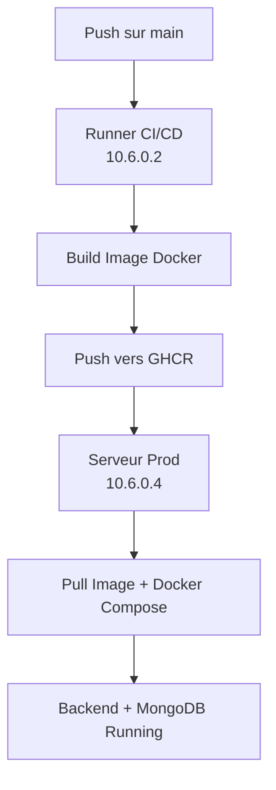

# 📦 Guide de Déploiement - Easypadel

Ce document décrit la procédure complète de déploiement de l'application Easypadel via GitHub Actions et Docker.

---

## 1. 🏗️ Architecture

| Composant | IP / Rôle | Description |
|-----------|-----------|-------------|
| **Runner GitHub (CI/CD)** | `10.6.0.2` | Serveur self-hosted qui construit et publie les images Docker |
| **Serveur de production** | `10.6.0.4` | Héberge le backend et MongoDB via Docker Compose |

### Diagramme de flux



---

## 2. ⚙️ Prérequis

### 2.1 Sur le Runner CI/CD (10.6.0.2)

- ✅ Docker et Docker Compose installés
- ✅ Accès au dépôt GitHub
- ✅ GitHub Actions Runner configuré en mode self-hosted

### 2.2 Sur le Serveur de Production (10.6.0.4)

- ✅ Docker et Docker Compose installés
- ✅ Accès SSH configuré pour GitHub Actions
- ✅ Fichier `.env` présent dans le répertoire de déploiement
- ✅ Fichier `docker-compose.yml` présent

### 2.3 Secrets GitHub à configurer

> [!IMPORTANT]
> Ces secrets doivent être configurés dans **Settings → Secrets and variables → Actions** de votre dépôt GitHub.

| Secret | Description | Exemple |
|--------|-------------|---------|
| `GHCR_USERNAME` | Nom d'utilisateur GitHub (en minuscules) | `monusername` |
| `GHCR_PAT` | Personal Access Token avec droits `write:packages` | `ghp_xxxx...` |
| `SSH_USER_PROD` | Utilisateur SSH du serveur de prod | `uha40` |
| `SSH_HOST_PROD` | IP du serveur de production | `10.6.0.4` |
| `SSH_PRIVATE_KEY_PROD` | Clé privée SSH (contenu complet) | `-----BEGIN OPENSSH...` |

---

## 3. 🔄 Pipeline GitHub Actions

Le pipeline se trouve dans `.github/workflows/ci-cd.yml` et se déclenche automatiquement sur chaque push sur la branche `main`.

### 3.1 Job 1 : Build et Publication

```yaml
# Variables globales
env:
  REGISTRY: ghcr.io
  IMAGE_NAME: easypadel-api
```

**Étapes :**
1. Checkout du code source
2. Connexion au GitHub Container Registry (GHCR)
3. Build de l'image Docker avec deux tags :
   - `latest` : version la plus récente
   - `SHA` : version tracée par commit
4. Push de l'image vers GHCR
5. Nettoyage des anciennes images

### 3.2 Job 2 : Déploiement

**Étapes :**
1. Vérification de la connexion SSH
2. Connexion à GHCR depuis le serveur prod
3. Pull de la dernière image
4. Redémarrage des conteneurs via Docker Compose

---

## 4. 📁 Fichiers de Configuration

### 4.1 docker-compose.yml (sur le serveur de prod)

```yaml
version: "3.9"

services:
  api:
    image: ghcr.io/<GHCR_USERNAME>/easypadel-api:latest
    container_name: easypadel-api
    ports:
      - "${API_PORT:-4000}:4000"
    env_file:
      - .env
    depends_on:
      - mongo
    restart: unless-stopped

  mongo:
    image: mongo:6
    container_name: easypadel-mongo
    ports:
      - "${MONGO_PORT:-27017}:27017"
    volumes:
      - mongo_data:/data/db
    restart: unless-stopped

volumes:
  mongo_data:
```

> [!WARNING]
> Remplacez `<GHCR_USERNAME>` par votre nom d'utilisateur GitHub en minuscules.

### 4.2 Fichier .env (sur le serveur de prod)

Créez un fichier `.env` dans le répertoire de déploiement :

```bash
# Configuration API
API_PORT=4000
NODE_ENV=production

# MongoDB
MONGO_PORT=27017
MONGO_URI=mongodb://mongo:27017/easypadel

# JWT (à adapter)
JWT_SECRET=votre_secret_jwt_tres_securise

# Autres variables selon vos besoins...
```

---

## 5. 🚀 Guide de Déploiement

### 5.1 Première Installation (sur le serveur de prod)

```bash
# 1. Connexion au serveur de production
ssh uha40@10.6.0.4

# 2. Créer le répertoire du projet
mkdir -p ~/easypadel
cd ~/easypadel

# 3. Créer le fichier docker-compose.yml
nano docker-compose.yml
# (Coller le contenu de la section 4.1)

# 4. Créer le fichier .env
nano .env
# (Ajouter vos variables d'environnement)

# 5. Se connecter à GHCR
docker login ghcr.io -u <VOTRE_USERNAME>
# Entrer votre Personal Access Token comme mot de passe

# 6. Télécharger l'image
docker pull ghcr.io/<VOTRE_USERNAME>/easypadel-api:latest

# 7. Démarrer les conteneurs
docker compose up -d

# 8. Vérifier que tout fonctionne
docker ps
curl http://localhost:4000/health  # ou votre endpoint de test
```

### 5.2 Déploiement Automatique (via GitHub Actions)

```bash
# Simplement pusher sur la branche main
git add .
git commit -m "feat: nouvelle fonctionnalité"
git push origin main
```

Le pipeline se déclenche automatiquement !

### 5.3 Déploiement Manuel (si nécessaire)

**Sur le serveur de production :**

```bash
# 1. Connexion SSH
ssh uha40@10.6.0.4

# 2. Aller dans le répertoire du projet
cd ~/easypadel

# 3. Télécharger la dernière image
docker pull ghcr.io/<VOTRE_USERNAME>/easypadel-api:latest

# 4. Redémarrer les conteneurs
docker compose down
docker compose up -d

# 5. Vérifier les logs
docker logs easypadel-api -f
```

---

## 6. 🔙 Rollback (Retour en arrière)

Si un déploiement cause des problèmes, vous pouvez revenir à une version précédente :

```bash
# 1. Lister les tags disponibles sur GHCR
# (visible sur github.com/<username>/easypadel/pkgs/container/easypadel-api)

# 2. Modifier docker-compose.yml avec le SHA du commit stable
# Exemple: ghcr.io/<username>/easypadel-api:abc123def456

# 3. Redémarrer
docker compose down
docker compose up -d
```

---

## 7. 📋 Commandes Utiles

| Commande | Description |
|----------|-------------|
| `docker ps` | Voir les conteneurs en cours |
| `docker logs easypadel-api -f` | Voir les logs du backend en temps réel |
| `docker logs easypadel-mongo -f` | Voir les logs de MongoDB |
| `docker compose down` | Arrêter tous les conteneurs |
| `docker compose up -d` | Démarrer tous les conteneurs |
| `docker compose restart api` | Redémarrer uniquement le backend |
| `docker exec -it easypadel-mongo mongosh` | Accéder à MongoDB |
| `docker system prune -a` | Nettoyer les images inutilisées |

---

## 8. 🔒 Sécurité

- ✅ **Secrets GitHub** : Tous les mots de passe et clés sont stockés de manière sécurisée
- ✅ **Images Docker tagguées** : Traçabilité via SHA Git
- ✅ **Rollback possible** : Grâce aux tags SHA sur GHCR
- ⚠️ **SSH StrictHostKeyChecking** : Désactivé dans le pipeline (acceptable pour environnement interne)

---

## 9. ⚠️ Actions Requises

> [!CAUTION]
> Avant le premier déploiement, vous devez effectuer ces actions :

1. **Configurer les secrets GitHub** (voir section 2.3)

2. **Modifier le chemin dans le workflow** :
   
   Dans `.github/workflows/ci-cd.yml`, ligne 70, remplacez :
   ```yaml
   cd /path/to/your/project/easypadel
   ```
   Par le chemin réel sur votre serveur, par exemple :
   ```yaml
   cd ~/easypadel
   ```

3. **Créer le Personal Access Token (PAT)** :
   - Aller sur GitHub → Settings → Developer settings → Personal access tokens
   - Générer un token avec les droits `write:packages` et `read:packages`

4. **Préparer le serveur de production** avec les fichiers `.env` et `docker-compose.yml`

---

## 10. 📞 Dépannage

### Le déploiement échoue avec "permission denied"
```bash
# Vérifier les permissions SSH
ssh -v uha40@10.6.0.4
```

### L'image ne se télécharge pas
```bash
# Vérifier la connexion à GHCR
docker login ghcr.io -u <username>
docker pull ghcr.io/<username>/easypadel-api:latest
```

### Le conteneur ne démarre pas
```bash
# Voir les logs d'erreur
docker logs easypadel-api
# Vérifier le fichier .env
cat .env
```
